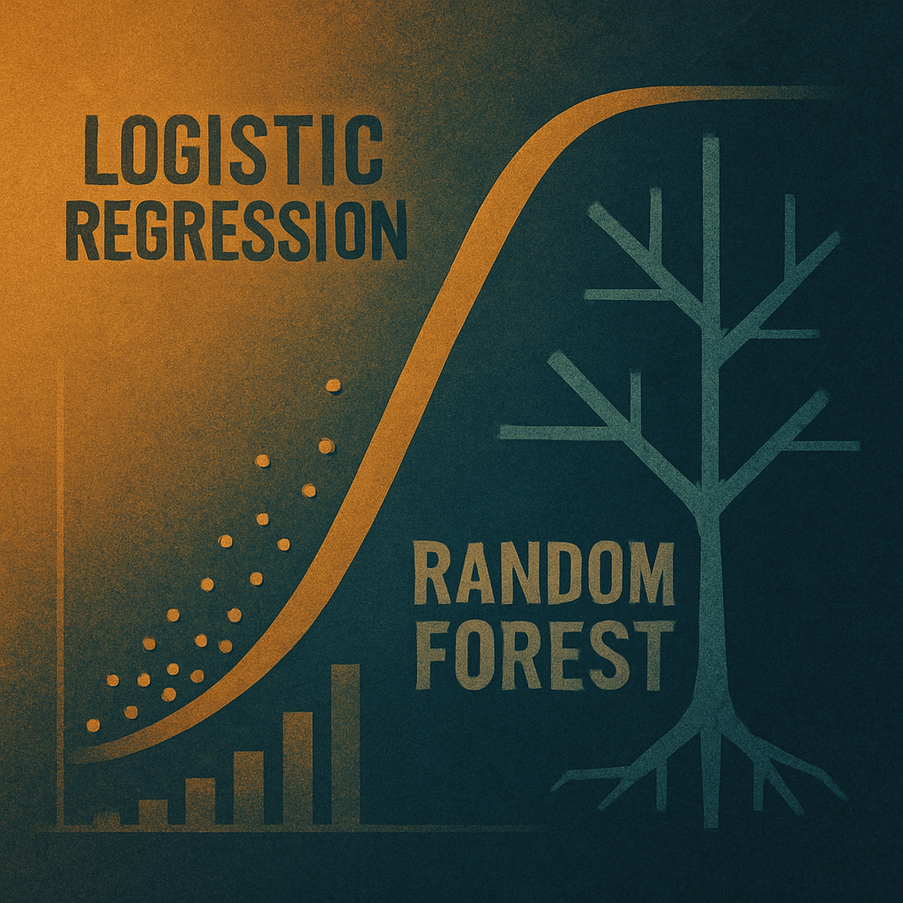
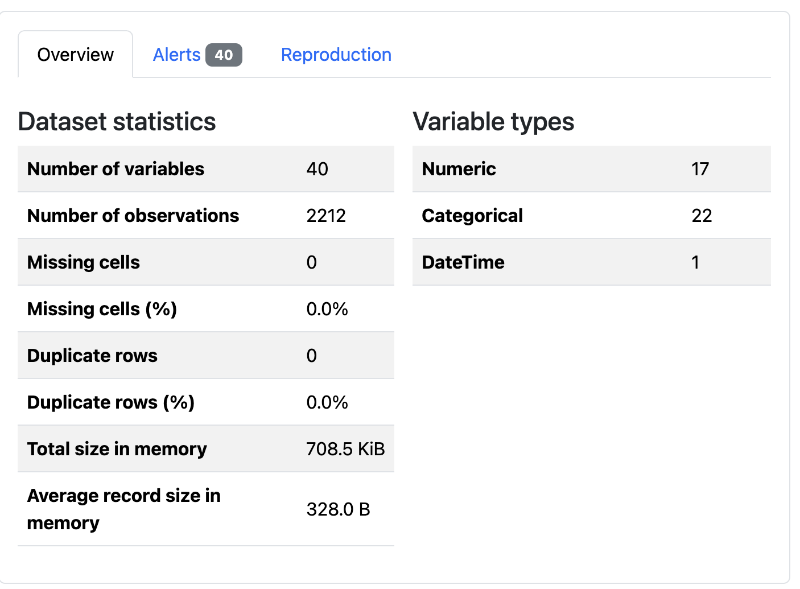
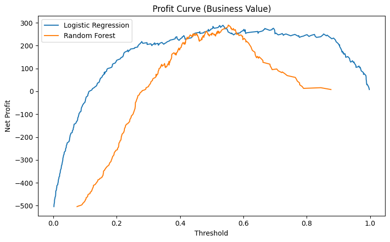

# Machine Learning & Predictive Analytics Assignment



## Overview

This repository contains an end-to-end machine learning pipeline for binary classification, developed as part of my MSc Data Science coursework at the University of the West of England.  
The project covers the **entire predictive analytics workflow**: data exploration, preprocessing, model training, evaluation, and interpretation—using a real-world dataset.

---

## Project Structure

```text
├── Reza's ML&PA Assignment.ipynb   # Main notebook
├── banner.png
├── eda.png
├── model_performance.png
├── README.md
```
---

## Key Steps

1. **Data Exploration (EDA)**
    - Loading data, initial inspection, summary statistics
    - Handling missing values and outliers
    - Visualizing feature distributions

    <!--  -->

2. **Preprocessing**
    - Feature engineering (creation, encoding, scaling)
    - Splitting data into training and test sets

3. **Model Training**
    - Applying classification algorithms (Logistic Regression, Random Forest, SVM, etc.)
    - Model selection and parameter tuning

4. **Evaluation**
    - Confusion matrix, precision, recall, F1-score
    - Business-relevant metrics
    - ROC curves, profit curves, feature importances

 

5. **Interpretation**
    - Feature importance analysis
    - Insights for business and technical audiences
---

## Dependencies

Main Python libraries used:
- pandas
- numpy
- matplotlib
- seaborn
- scikit-learn
